<div align="center">


<br>

[](https://www.linkedin.com/company/acm-nanocom-2026/home/)
[](https://doi.org/10.1145/3818305.3830252)
[](https://creativecommons.org/licenses/by/4.0/)
[](https://doi.org/10.1145/3818305.3830252)

<h3>🌿 Treating a plant as a communication system to decode its stress state 🌿</h3>

<p>
<b>13th ACM International Conference on Nanoscale Computing and Communication (NANOCOM '26)</b><br>
St. John's, NL, Canada &nbsp;•&nbsp; September 21–23, 2026
</p>

<p>
<a href="#-abstract">Abstract</a> •
<a href="#-key-idea">Key Idea</a> •
<a href="#-contributions">Contributions</a> •
<a href="#-results">Results</a> •
<a href="#-authors">Authors</a> •
<a href="#-citation">Citation</a> •
<a href="#-getting-started">Getting Started</a>
</p>

</div>

<br>

## 📖 Abstract

> Plant electrophysiological signals encode responses to environmental stress, yet stress inference is typically treated as a generic classification task — disregarding the underlying encoding process and limiting robustness under non-stationary conditions.

We reformulate stress detection as a **receiver-side decoding problem** over a biological communication channel, where the plant acts as an encoder, physiological dynamics define the channel, and electrical activity is processed to infer the latent physiological state.

We propose a receiver architecture integrating interference suppression, finite-horizon temporal integration, and a structured multi-domain feature embedding capturing statistical, temporal, spectral, and multiscale characteristics. Detection is performed via a histogram-based gradient boosting model that approximates the likelihood ratio in the embedded space — achieving near-complete separability between nominal and stress-induced conditions, with minimal sensitivity to threshold selection.

<br>

## 🧠 Key Idea

This work borrows the language of communication theory to reframe biological sensing. The plant is treated as a **biological transmitter**, encoding an environmental stimulus into an internal physiological state and a measurable electrophysiological response. Electrodes and acquisition hardware form the **propagation channel**, and a structured feature-extraction and decision pipeline plays the role of the **receiver**.

```mermaid
flowchart LR
    A["🌍 Environmental Stimulus<br/>drought · nutrient deficiency · biotic stress"] --> B["🌱 Biological Encoder<br/>plant physiological mechanisms"]
    B --> C["⚡ Electrophysiological Response<br/>membrane potential · ion transport"]
    C --> D["📡 Biological Channel<br/>propagation through plant tissue"]
    D --> E["🎚️ Receiver Front-End<br/>sensing · interference suppression"]
    E --> F["🧩 Feature Embedding<br/>statistical · temporal · spectral · multiscale"]
    F --> G{"🎯 Decision Rule"}
    G -->|H₀| H["✅ Nominal Condition"]
    G -->|H₁| I["⚠️ Stress Detected"]

    style A fill:#1B998B,stroke:#0F5FA6,color:#fff
    style B fill:#1B998B,stroke:#0F5FA6,color:#fff
    style C fill:#2E9EF7,stroke:#0F5FA6,color:#fff
    style D fill:#2E9EF7,stroke:#0F5FA6,color:#fff
    style E fill:#0F5FA6,stroke:#0F5FA6,color:#fff
    style F fill:#0F5FA6,stroke:#0F5FA6,color:#fff
    style G fill:#F2994A,stroke:#F2994A,color:#fff
    style H fill:#27AE60,stroke:#27AE60,color:#fff
    style I fill:#EB5757,stroke:#EB5757,color:#fff
```



<br>

## ✨ Contributions

<table>
<tr>
<td width="50%" valign="top">

**🔬 Theoretical Formulation**
A communication-theoretic formulation of plant stress inference as binary detection under unknown, non-stationary statistics.

</td>
<td width="50%" valign="top">

**🧩 Structured Feature Embedding**
A finite-dimensional representation capturing stress-associated variability, distributional asymmetry, temporal organization, spectral energy, and multiscale irregularity.

</td>
</tr>
<tr>
<td width="50%" valign="top">

**⚙️ Practical Detector**
A histogram-based gradient boosting model, interpreted as a practical approximation of the likelihood ratio in the embedded space.

</td>
<td width="50%" valign="top">

**📈 Empirical Validation**
Experimental evidence that the resulting representation is highly structured and nearly separable across stress conditions.

</td>
</tr>
</table>

<br>

## 📊 Results

<div align="center">


</div>

| Metric | Value | What it means |
|---|:---:|---|
| **Macro-averaged F1** | `0.9879` | Balanced precision/recall across both physiological classes |
| **ROC AUC** | `0.9992` | Near-perfect ranking of stressed vs. nominal samples |
| **Precision–Recall AUC** | `0.9993` | Strong performance even under class imbalance |
| **Inference time** | `~0.10 ms/segment` | Fast enough for real-time, on-device deployment |

The resulting decision statistic exhibits **near-complete separability**, minimal overlap around the decision boundary, and limited sensitivity to threshold selection.

<br>

## 👥 Authors

<div align="center">

| | | |
|:---:|:---:|:---:|
| **Zahra Nazar Zadeh Attar** | **Iman Javaheri Neyestanak** | **Kasra Alizadeh** |
| Politecnico di Milano | Politecnico di Milano | Politecnico di Milano |
| **Arek Berc Gokdag** | **Maurizio Magarini** | **Silvia Mura** |
| Politecnico di Milano | Politecnico di Milano | Politecnico di Milano |

</div>

<br>

## 🔑 Keywords

<div align="center">

`plant electrophysiology` `stress detection` `bioelectrical communication` `machine learning` `signal processing` `precision agriculture`

</div>

<br>

## 📄 Citation

If you use this work in your research, please cite:

<details>
<summary><b>📚 BibTeX</b> (click to expand)</summary>

```bibtex
@inproceedings{attar2026plantstress,
  author    = {Nazar Zadeh Attar, Zahra and Javaheri Neyestanak, Iman and Alizadeh, Kasra and Gokdag, Arek Berc and Magarini, Maurizio and Mura, Silvia},
  title     = {Plant Stress Decoding from Electrophysiological Signals: A Bioelectrical Communication Framework},
  booktitle = {Proceedings of the 13th Annual ACM International Conference on Nanoscale Computing and Communication (NANOCOM '26)},
  year      = {2026},
  address   = {St. John's, NL, Canada},
  publisher = {ACM},
  pages     = {6},
  doi       = {10.1145/3818305.3830252},
  url       = {https://doi.org/10.1145/3818305.3830252}
}
```

</details>

<details>
<summary><b>📝 ACM Reference Format</b> (click to expand)</summary>
<br>

Zahra Nazar Zadeh Attar, Iman Javaheri Neyestanak, Kasra Alizadeh, Arek Berc Gokdag, Maurizio Magarini, and Silvia Mura. 2026. Plant Stress Decoding from Electrophysiological Signals: A Bioelectrical Communication Framework. In *13th Annual ACM International Conference on Nanoscale Computing and Communication (NANOCOM '26), September 21–23, 2026, St. John's, NL, Canada.* ACM, New York, NY, USA, 6 pages. https://doi.org/10.1145/3818305.3830252

</details>

<br>

## ⚙️ Getting Started

```bash
git clone https://github.com/<your-username>/plant-stress-bioelectrical-decoding.git
cd plant-stress-bioelectrical-decoding
pip install -r requirements.txt
```

<br>

## 📜 License

This work is licensed under a [Creative Commons Attribution 4.0 International License (CC BY 4.0)](https://creativecommons.org/licenses/by/4.0/), consistent with the ACM open-access license under which the paper was published.

`ACM ISBN: 979-8-4007-2767-2/26/09`

<br>

## 🙏 Acknowledgments

We are grateful to our mentors, **Prof. Silvia Mura**, **Prof. Maurizio Magarini**, and **Arek Berc Gokdag**, for their guidance throughout this research, developed at **Politecnico di Milano**.

<br>

<div align="center">

📄 [Read the Paper](https://doi.org/10.1145/3818305.3830252) &nbsp;•&nbsp; 🔗 [NANOCOM '26 Conference](https://www.linkedin.com/company/acm-nanocom-2026/home/) &nbsp;•&nbsp; ✉️ [Contact](mailto:k.alizadeh.dev@gmail.com)


</div>
